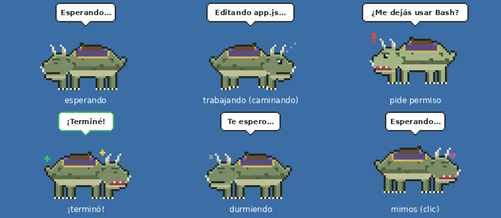

# Mascota de Claude Code para Windows

Una bestia pixel-art que pasea por tu escritorio y te muestra qué está haciendo Claude Code: si está esperando (pasea y después de un rato se duerme), trabajando (camina decidida), si necesita tu permiso (salta con la boca abierta, parpadea y suena un "din-don") o si ya terminó (festeja).

Funciona solo con Windows PowerShell y .NET, que ya vienen con Windows, así que no hace falta instalar nada.

## Instalación

1. Bajá el repositorio a tu PC: en GitHub, **Code → Download ZIP** y descomprimilo, o `git clone https://github.com/patricioguinazu11/mascota-claude.git`.
2. Hacé doble clic en **`instalar.bat`**. Si Windows muestra "Windows protegió su PC", tocá *Más información → Ejecutar de todas formas*.
   (Alternativa desde PowerShell: `powershell -ExecutionPolicy Bypass -File .\instalar.ps1`.)
3. Si tenías Claude Code abierto, cerralo y volvelo a abrir para que tome los hooks.

La mascota aparece abajo a la derecha y a partir de ahí arranca sola cada vez que prendés la PC.

## Uso

- **Arrastrala** con el botón izquierdo a donde quieras: camina a lo largo de esa altura y se acuerda de la posición.
- **Un clic** le da mimos. **Doble clic** trae al frente la ventana de Claude Code (útil cuando pide permiso).
- **Clic derecho** para prender o apagar el sonido, activar o desactivar la caminata, devolverla a la esquina o cerrarla.
- Si pasás el mouse por encima, te dice en qué proyecto está trabajando Claude.
- Claude Code tiene que estar abierto en una carpeta de proyecto (no en tu carpeta de usuario) para que la mascota se entere de lo que hace.

Para cambiarle el diseño, editá el dibujo en `src/mascota.ps1` (sección *Personaje*): cada letra es un color y hay un cuadro por pose de caminata.

## Desinstalación

Doble clic en **`desinstalar.bat`** (o `powershell -ExecutionPolicy Bypass -File .\desinstalar.ps1`).

También queda una copia en `%LOCALAPPDATA%\ClaudeMascota\desinstalar.ps1`. Cierra la mascota, quita solo sus hooks del `settings.json`, borra el acceso directo de Inicio y la carpeta instalada.

## Qué toca en tu PC

| Qué | Dónde |
| --- | --- |
| Archivos de la mascota | `%LOCALAPPDATA%\ClaudeMascota` |
| Hooks de Claude Code | `%USERPROFILE%\.claude\settings.json` (antes de modificarlo deja una copia `settings.json.bak-mascota-FECHA`) |
| Arranque con Windows | Acceso directo `Mascota Claude` en la carpeta Inicio |

Los hooks que agrega son `UserPromptSubmit`, `PreToolUse`, `PostToolUse` (para salir del estado de "permiso" cuando aprobás), `Notification`, `Stop` y `SessionEnd`. Corren en segundo plano (`"async": true`), así que no frenan a Claude; solo `Stop` corre en primer plano (demora medio segundo al final de cada respuesta) porque en segundo plano no se ejecutaba. Todo lo demás que tengas en `settings.json` queda igual.

## Si algo no anda

Primero hacé doble clic en **`diagnosticar.bat`**: revisa la instalación, los hooks y simula un aviso de Claude Code. Cada llamada de Claude a la mascota queda anotada en `%LOCALAPPDATA%\ClaudeMascota\hook.log`.

- **No cambia de estado:** abrí Claude Code en una carpeta de proyecto y aceptá que confiás en ella (los hooks no corren en carpetas no confiables, y tu carpeta de usuario puede no quedar marcada como confiable); reiniciá Claude Code y fijate que en `settings.json` estén los hooks que apuntan a `ClaudeMascota/hook.ps1`.
- **No aparece:** abrila a mano con `powershell -ExecutionPolicy Bypass -File "$env:LOCALAPPDATA\ClaudeMascota\mascota.ps1"` y mirá si hay errores en `%LOCALAPPDATA%\ClaudeMascota\mascota.log`.
- **Quedó en un estado viejo** (por ejemplo, si cortaste a Claude con Esc): vuelve sola a "esperando" a los pocos minutos, o con el próximo mensaje que le mandes.
